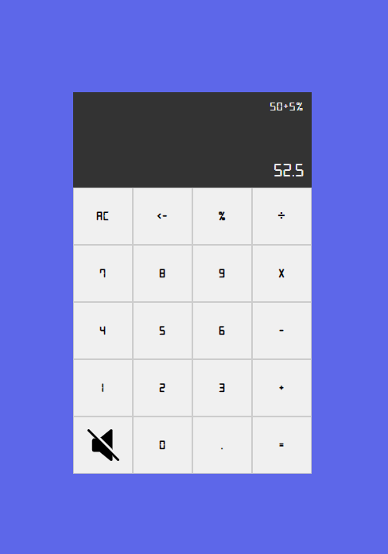

# javascript-calculator
Calculadora - Javascript 📈

## Realiza:
- Soma.
- Subtração.
- Divisão.
- Multiplicação.
- Porcentagem (adição).
- Porcentagem (subtração).
- Porcentagem (multiplicação).
- Tecla para ativar/desativar som.
- AC (All Clear - limpa tudo).
- <- (Clean last character - apaga último caracter) - Cálculo continua sendo realizado conforme vai apagando.

